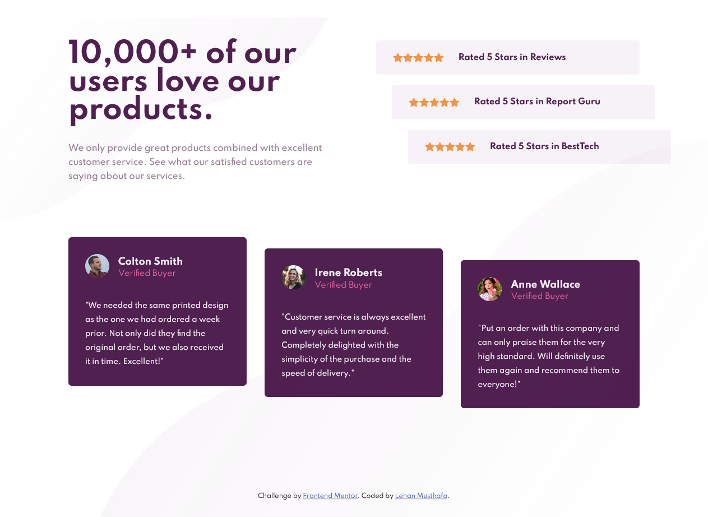

# Frontend Mentor - Social proof section solution

This is a solution to the [Social proof section challenge on Frontend Mentor](https://www.frontendmentor.io/challenges/social-proof-section-6e0qTv_bA). Frontend Mentor challenges help you improve your coding skills by building realistic projects. 

## Table of contents

- [Overview](#overview)
  - [The challenge](#the-challenge)
  - [Screenshot](#screenshot)
  - [Links](#links)
- [My process](#my-process)
  - [Built with](#built-with)
  - [What I learned](#what-i-learned)
  - [Continued development](#continued-development)
  - [Useful resources](#useful-resources)
- [Author](#author)
- [Acknowledgments](#acknowledgments)

**Note: Delete this note and update the table of contents based on what sections you keep.**

## Overview

### The challenge

Users should be able to:

- View the optimal layout for the section depending on their device's screen size

### Screenshot

### Links

- Solution URL: [https://github.com/LehanMusthafa/social-proof-section](https://github.com/LehanMusthafa/social-proof-section)
- Live Site URL: [Add live site URL here](https://your-live-site-url.com)

## My process

### Built with

- Semantic HTML5 markup
- Media queries
- Flexbox
- Mobile-first workflow

### What I learned

By doing this project, I've learned a lot about css flexbox. It was very handy. I could also use css-grid, but I chose flexbox. I believe that you can learn a lot more about css-grid and flexbox by doing this project.

### Continued development

By this time I've learned a lot about css flexbox. But I'm not so practised with css-grid method, so I would be focusing on that in the coming projects.

### Useful resources

- [social_proof_Web](https://github.com/krysnkem/Christian-social-proof-section-master) - This project helped me very much in adding the css properties.

## Author

- Website - [Lehan Musthafa](https://buymeacoffee.com/lehanmusthafa)
- Frontend Mentor - [@LehanMusthafa](https://www.frontendmentor.io/profile/LehanMusthafa)
- Twitter - [@lehan_musthafa](https://www.twitter.com/lehan_musthafa)